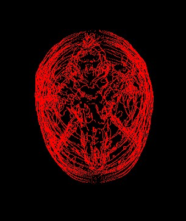

# Reconstruction_3D_Proyecto3
Proyecto de Puntos en reconstrucción 3D de una tomografía
# Fotos Link
* https://www.kaggle.com/vbookshelf/computed-tomography-ct-images
* File 130
# Fotos
### 1-

### 2-

### 3-

### 5-

# Codigo
### Binarization
* Funcion de Barrido o Binarizado de Vectores para los puntos de las imagenes
``` C++
CImg <char> Point::barrido_vector(CImg<> &picturee, int cominezo) const {
    CImg <char> DOULE(picturee.width(),picturee.height());
    FOR(i,0,picturee.width())
    {
        FOR(j,0,picturee.height())
        {
            int r = (int)picturee(i, j, 0),
                g = (int)picturee(i, j, 1),
                b = (int)picturee(i, j, 2);
            DOULE(i, j) = (char) ((r + g + b) / 3 > cominezo ? 0 : 255);

        }
    }
    return DOULE;
}
```
* lectura de las imagenes y con un bucle, donde uso el barrido_vector
``` C++
void Point::verPicture(const string& road_picture, int cominezo) {
    ifstream road_file(road_picture.c_str());
    string ruta;
    while (getline(road_file, ruta)) {
        CImg <float> imagenInicial(ruta.c_str());
        //La Magia de los puntos
        CImg <char> imagenFinal = barrido_vector(imagenInicial, cominezo);
        //FIN de la MAGIC
        this->picture_.emplace_back(imagenFinal);
        this->num_picture_++;
    }
    road_file.close();
}
```